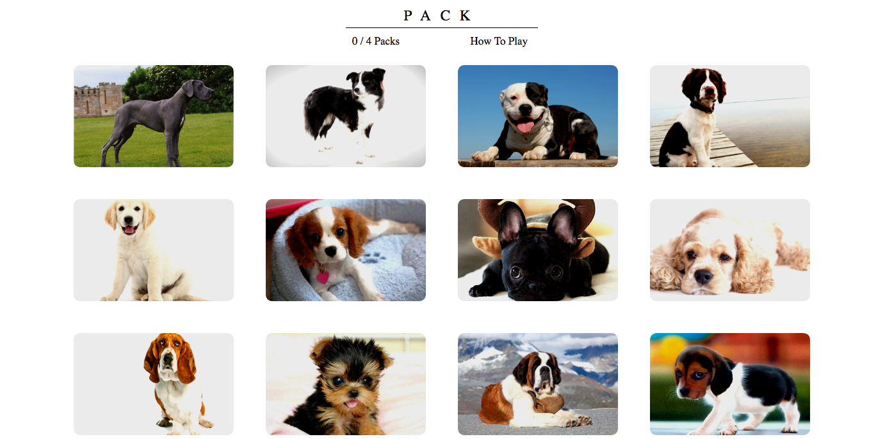
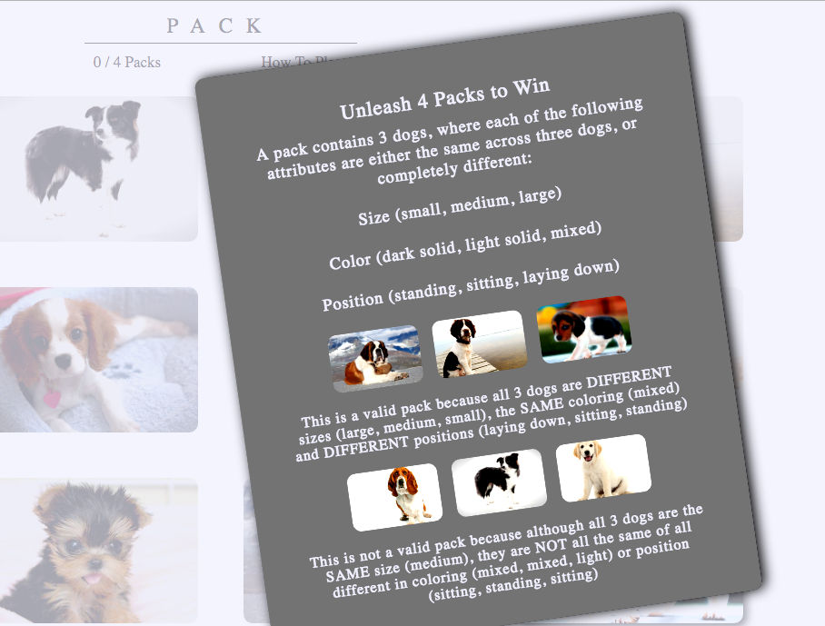

#PACK
[Pack iive][https://aaronwithonea.github.io/PACK]
[github][https://github.com/AaronwithoneA/PACK]

PACK  is a dog themed implementation of the classic card game SET.  The goal of the game is to identify packs(sets) of 3 dogs that are either all the same or all different across 3 attributes:

Size (small, medium or large)
Coloring (dark, light, or mixed)
Position (sitting, standing, or laying down)

There are a total of 12 cards and the game is won after identifying 4 packs.  

##How the Game was Built

The game is built on matching logic that waits for three dogs to be selected and then determines whether the match
is correct by progressively comparing each attribute across the three dogs.  Each correct packs is then added to an array of packs that is used to compare subsequent pack choices so that the user cannot choose duplicate packs.

```  
checkMatch() {
    if (this.props.cards.length > 2) {
      const cards = this.props.cards;
      if (this.compareAttribute(cards, "size")) {
        if (this.compareAttribute(cards, "color")) {
          if (this.compareAttribute(cards, "position") && this.checkDuplicate() ) {
            return true;
          } else {
            return false;
          }
        } else {
          return false;
        }
      } else {
        return false;
      }
    }
    return "<";
  }

  compareAttribute (cards, attribute) {
    return (
      (cards[0][attribute] === cards[1][attribute]
      && cards[1][attribute] === cards[2][attribute]) ||
      (cards[0][attribute] !== cards[1][attribute]
        && cards[1][attribute] !== cards[2][attribute]
          && cards[0][attribute] !== cards[2][attribute])
    );
  }
  ```

The styling and responsive design of the game were achieved through use of CSS flex box, as well as CSS filters, transformations, and hover effects.  



The game additionally includes detailed verbal and visual instructions on gameplay
in a React modal.  


