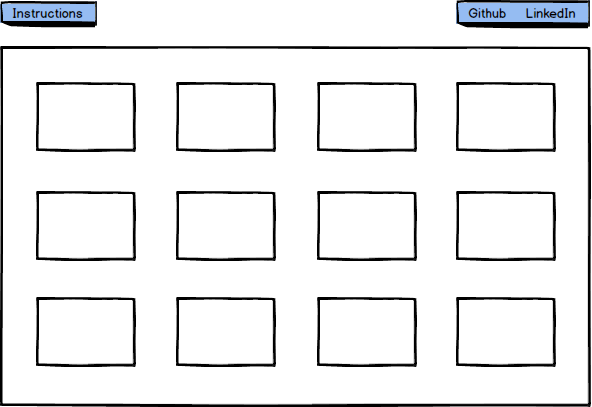

## PACK (Dog themed implementation of the game SET)

### Background

The game SET is a clever matching game involving a board with 12 cards.  In the traditional game, each card contained squiggle shapes of varying colors, patterns, and quantities.  There are 1, 2 or 3 squiggles that are red, green, or blue, with solid, striped, or empty patterns.  The goal of the game is to choose sets of 3 cards where every card is exactly the same of different on each of the attributes.  For example, a set of 3 solid green squiggles, 2 solid green squiggles, and 1 solid green squiggle or 3 solid green squiggles, 2 striped blue squiggles, and 1 empty red squiggle would both be valid sets.  This version will instead consist of pictures of dogs and the attributes will be size(large, medium, small), color(black, white, brown) and position(sitting, standing, laying down).

### Functionality & MVP  

Users will be able to

- [ ] Select and unselect cards chosen for each set until 3 cards are chosen, at which point all cards will be unselected.
- [ ] Correct sets will be recorded until 4 sets have been identified and the game ends

In addition, this project will include:

- [ ] An About modal describing the background and rules of the game
- [ ] A production Readme

### Wireframes

This app will consist of a single page containing 12 styled cards with pictures of dogs on them.  Additionally, there will be a link to the instructions modal and links to the game's Github page, my personal linkedin page, and eventually, a link to my personal website.  

There will be an instructions modal thats opened from a button on the top
of the page.  It will include a description of the game, the 3 attributes,
and visual examples of a valid and invalid pack.

### Architecture and Technologies

This project will be implemented with the following technologies:

- React and Redux for user interaction and DOM manipulation.
- HTML and CSS for page structure and styling of cards and nav links.  

- Webpack to bundle and serve up the various scripts.

There will be two React components in this project:  

`board.jsx`: This file will handle the logic for the board, including matching cards, and deciding when the game has been won.  

`card.jsx':  This file will contain the logic for the individual card objects.  

### Implementation Timeline

**Day 1**: Configure all of the basic setup for the app including node and npm packages, webpack configuration, and the basic file tree.  
- Get a green bundle with `webpack`
- Design the overall object oriented structure, including the roles differentiation between board and card rules.
- Research techniques for implementing interesting graphics when sets are collected and games are won.

**Day 2**: Design the majority of the board logic while keeping in mind the general card structure.  

- Complete the majority of the board module.  

**Day 3**: Build the card module and instructions modal.  

- Export a 'card' module that is used in the board module.  
- Create and style instructions for the game that will pop up in a modal upon clicking a nav link.  

**Day 4**: Collect beautiful photos of dogs with the appropriate qualities.  Complete all of the styling.

- Style board and cards with photos of dogs.  

### Bonus features

Some anticipated updates are:

- [ ] Create an interesting graphic for a game win condition involving a pack of dogs crossing from left to right on the screen.  
